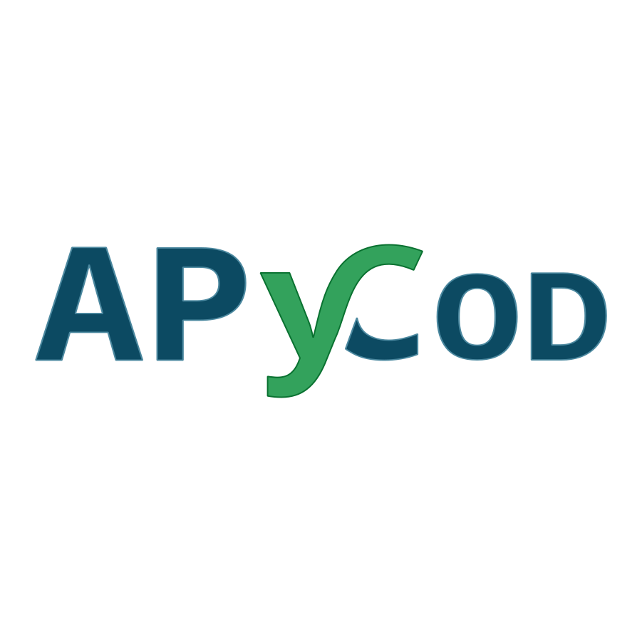
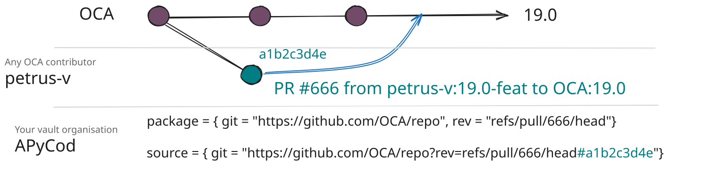
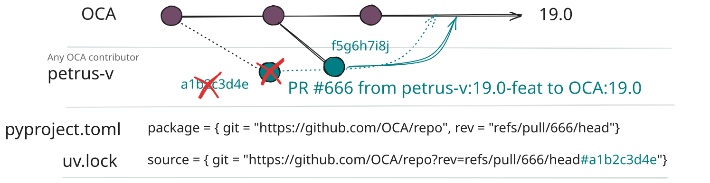
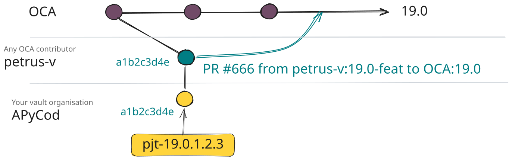
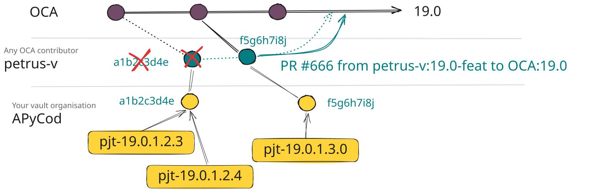
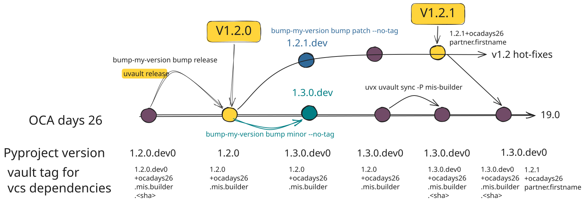

<style scoped>
h1, h1 strong {
  color: var(--color-foreground) !important;
}
p, strong {
  color: var(--color-dimmed) !important;
}
</style>


# **My Odoo development Environment**

### With `uv`, `hatch-odoo` and **`uvault`**

**Pierre Verkest (APYCOD)**
GitHub: @petrus-v

<!--
Hello everyone, and welcome to this session at OCA Days 2026.
My name is Pierre Verkest from APYCOD, and today I'm excited to talk about how we can make Odoo projects as Pythonic as possible—simplifying onboarding and engaging Python developers—while taking your project smoothly from local dev all the way to production using tools like uv, hatch-odoo, and a dedicated new tool called uvault.
-->

---

# **About**

**Pierre Verkest** — An enthusiastic independant python developer @ APYCOD




- gh: @petrus-v
- ln: @pierre-verkest
- OCA Contributor
- pytest-odoo Contributor
- Author of `uvault`


<!--
To introduce myself: I'm Pierre Verkest from APYCOD, Odoo developer, OCA contributor, and creator of uvault.
Historically, Odoo struggled to integrate smoothly with standard Python tooling due to legacy mechanisms like addons_path. Today, thanks to uv, pyproject.toml, whool, and hatch-odoo, Odoo fits naturally into the modern Python ecosystem!
-->

---

# **Agenda**

- **Context**: Historically, Odoo struggled with standard Python tooling (`addons_path`). Today, it integrates seamlessly (`uv`, `pyproject.toml`)!

1. 🐍 **Odoo as a Standard Python Project**: Modern tooling (`uv`, PyPI, `whool`, Python Namespace Packages)
2. ⚙️ **Dedicated Odoo Build Backend**: Streamlining Odoo packaging with `hatch-odoo`
3. 🔀 **Unreleased PR Dependencies**: Working with unmerged OCA Pull Requests
4. 🛡️ **DEEP DIVE `uvault`**: Vaulting, local editable dev & release lifecycle

<!--
Here is our agenda today:
1. Managing an Odoo project like a standard Python project using uv, PyPI, whool, and Python namespace packages.
2. Using a dedicated Odoo build backend (hatch-odoo) for flexible addons_dirs and dynamic dependency management.
3. Working with unreleased PR dependencies and handling unmerged OCA Pull Requests.
4. A deep dive into uvault for vaulting PRs, managing local editable workflows, and release lifecycles.
-->

---

<!-- _class: lead -->
# **Odoo as a Standard Python Project**

<!--
Let's see how an Odoo project can be initialized, configured, and managed like any standard Python project.
-->

---

# **Project Initialization (`uv init`)**

### Repository setup

```bash
uv init ocadays-2026-odoo-dev
cd ocadays-2026-odoo-dev
```

### Repository layout 📂

```text
ocadays-2026-odoo-dev/
├── .python-version      # Target Python version (e.g. 3.14)
├── pyproject.toml       # Project metadata & dependencies
└── README.md
```

> ⚡ **Result**: Your project root is initialized with standard Python configuration files!

<!--
Presenter Note: Step 0 (git checkout step-0)
In milliseconds, uv initializes a clean Python repository with pyproject.toml and .python-version.
-->

---

# **Installing Odoo Core & Custom Addon**

### Custom addon: `src/odoo/addons/ocadays_2026/__manifest__.py`

```python
{
    "name": "OCA Days 2026 - odoo dev module",
    "version": "19.0.1.0.0",
    "depends": ["web"],
}
```

### Declare Odoo dependency in `pyproject.toml`

```toml
[project]
name = "ocadays-2026-odoo-dev"
version = "0.1.0"
dependencies = [
    "odoo", "lxml>=5.2.1", "lxml-html-clean", "Werkzeug==3.0.1", "PyPDF==5.4.0", "freezegun",
]

[tool.uv.sources]
odoo = { git = "https://github.com/OCA/OCB.git", branch = "19.0" }
```

<!--
Presenter Note: Step 1 (git checkout step-1)
We create our custom Odoo module inside src/odoo/addons/ocadays_2026 and declare Odoo 19.0 from OCB git repository in pyproject.toml.
-->

---

# **Running Odoo with `uv run`**

### Auto-synced virtual environment

```bash
# Sync environment & build virtualenv automatically
uv sync

# Run Odoo CLI with manual --addons-path for local custom module
uv run odoo \
  --addons-path=src/odoo/addons \
  -d ocadays2026 -i ocadays_2026 \
  --stop-after-init
```

> 💡 **No `source .venv/bin/activate` needed!** `uv run` syncs and runs inside `.venv` seamlessly.

<!--
Presenter Note: Step 1 (continued)
Notice how Odoo starts immediately with uv run. uv handles virtualenv creation transparently.
-->

---

# **Python Namespace Packages (`odoo.addons`)**

### PEP 420: Sharing single namespace across packages

- **Concept**: Allows multiple independent distributions (core Odoo, custom module)
  to contribute modules to the same top-level Python package: `odoo.addons`.
- **Configure with `uv_build` backend** in `pyproject.toml`:

```toml
[tool.uv.build-backend]
module-name = "odoo.addons"
namespace = true

[build-system]
requires = ["uv_build>=0.12.4,<0.13.0"]
build-backend = "uv_build"
```

> 💡 *Note: We use `uv_build` backend here (Astral's build backend). Standard backends like `hatchling` or `flit` also support PEP 420 namespace packages, though configuration syntax varies.*

### `--addons-path` is NOW OBSOLETE!

`uv run` links `src/odoo/addons/ocadays_2026` into `.venv` under `odoo.addons` (in editable mode):

```bash
# No --addons-path needed anymore!
uv run odoo -d ocadays2026 -i ocadays_2026 --stop-after-init
```

<!--
Presenter Note: Step 2 (git checkout step-2)
By configuring module-name = "odoo.addons" and namespace = true with uv_build, uv exposes our local module inside .venv under odoo.addons in editable mode (PEP 660).
Now uv run odoo finds ocadays_2026 natively in odoo.addons without requiring --addons-path!
-->

---

# **Adding OCA Dependencies (PyPI & `whool`)**

### Update manifest `src/odoo/addons/ocadays_2026/__manifest__.py`

```python
    "depends": ["web", "mis_builder"],
```

### Add PyPI package to `pyproject.toml`

```toml
[project]
...
dependencies = [
    ...
    "odoo-addon-mis-builder>=19.0",
]
```

### Run `uv sync`

```bash
uv sync
# -> Downloads mis_builder, date_range & report_xlsx from PyPI!
```

<!--
Presenter Note: Step 3 (git checkout step-3)
We add an OCA dependency, mis_builder.
We add "mis_builder" to our manifest depends and "odoo-addon-mis-builder" to pyproject.toml.
uv sync fetches the wheel from PyPI alongside all its transitive OCA dependencies!
-->

---

# **Under the Hood: PyPI & `whool` 📦**

### Did you know EVERY OCA module is published on PyPI?

- Huge thanks to **Stéphane Bidoul** for the **`whool`** build backend!
- OCA repositories automatically build and publish standard Python wheels on **pypi.org**.
- Standard PyPI naming convention: `odoo-addon-<module_name>`
  - `mis_builder` ➡️ `odoo-addon-mis-builder`
  - `partner_firstname` ➡️ `odoo-addon-partner-firstname`

```bash
# Adding any OCA module is standard Python package management!
uv add odoo-addon-account-financial-report
```

<!--
Thanks to whool by Stéphane Bidoul, every OCA module builds standard Python wheels on PyPI under the naming scheme odoo-addon-<module>.
-->

---

# **IDE Pro-Tip: Navigating `site-packages` 💡**

### Everything is installed in `.venv/lib/python3.x/site-packages/`

- All OCA modules and Odoo core reside inside your `.venv`.
- **Recommended practice**: Add `.venv/.../site-packages/odoo/addons` to your IDE workspace (VSCodium / VS Code / PyCharm).

### Key developer benefits:
- 🔍 **Global Code Search**: Search classes, views, and methods across all OCA addons.
- 🐞 **Seamless Debugging**: Set breakpoints directly inside any third-party OCA module.
- 🎯 **Go-to-Definition**: Fast navigation to inherited models and methods.

<!--
Presenter Note: (In VSCodium demo, show adding site-packages/odoo/addons to workspace folders)
Explain how adding site-packages/odoo/addons to the workspace gives full code search, autocompletion, and breakpoint capabilities across all installed OCA modules!
-->

---

# **Reproducibility & Security: `uv.lock`**

### Deterministic & Tamper-proof Lockfile

- **Cross-platform lockfile**: Multi-OS & multi-Python version locking.
- **Supply Chain Protection**: Verifies SHA256 hashes & Git commits to prevent package tampering.
- **Strict CI & Production Deployment**:
  - 🔒 `uv sync --locked`: Fails if `uv.lock` is out-of-sync with `pyproject.toml` (CI assertion).
  - 🧊 `uv sync --frozen`: Installs directly from `uv.lock` without modifying it (Fast Docker/Prod builds).
- 📤 **Legacy Export**: `uv export` to `requirements.txt` or standard `pylock.toml` (PEP 751).

> 💡 **Pro-Tip (`pre-commit`)**: Keep `uv.lock` automatically in sync:

```yaml
- repo: https://github.com/astral-sh/uv-pre-commit
  rev: 0.12.5
  hooks:
    - id: uv-lock
```

<!--
Presenter Note:
uv.lock guarantees absolute reproducibility and supply chain security across all environments.
By recording and checking SHA256 hashes during uv sync, uv prevents tampered or compromised packages from being installed.
Explain the difference: --locked asserts that lockfile matches pyproject.toml in CI. --frozen installs strictly from lockfile without modifying it (perfect for fast Docker builds). Mention uv export for legacy tools.
(However, if a Git dependency commit vanishes upstream, lockfile reproducibility alone cannot restore the missing commit!)
-->

---

<!-- _class: lead -->
# **A Dedicated Build Backend for Odoo**
### Streamlining Odoo packaging with `hatch-odoo`

<!--
Section 2: Let's discover how dedicated build backends like hatch-odoo make managing Odoo projects even easier.
-->

---

# **What is a Build Backend? (`hatch` & `hatch-odoo`)**

### Definitions & Ecosystem

- **Build Backend** (PEP 517 / PEP 518): The tool responsible for compiling source code into standard Python distribution packages (`.whl` wheels or `.tar.gz` sdist). Examples: `setuptools`, `flit`, `hatchling`, `uv_build`.
- **Hatch / Hatchling**: A modern, highly extensible Python build backend that supports custom build and metadata hooks.
- **`hatch-odoo`**: A specialized Hatch plugin created by **Stéphane Bidoul** (ACSONE) tailored specifically for Odoo projects.

### What value does `hatch-odoo` add?
1. 📂 **Flexible `addons_dirs`**: Maps any project directory into `odoo.addons` without rigid `src/odoo/addons/` folder constraints.
2. 🪄 **Dynamic Dependencies**: Automatically resolves PyPI requirements directly from `__manifest__.py`.

---

# **Flexible Addons Paths with `hatch-odoo`**

### Configure `hatch-odoo` build backend in `pyproject.toml`

```toml
[build-system]
requires = ["hatchling", "hatch-odoo"]
build-backend = "hatchling.build"

# Enable hatch-odoo build hook for local addons directory
[tool.hatch.build.hooks.odoo-addons-dirs]

[tool.hatch-odoo]
addons_dirs = ["src/odoo/addons"]
```

### Why `addons_dirs` is a game changer
- Standard `uv_build` namespace requires a strict nested folder layout: `src/odoo/addons/<addon_name>`.
- **`hatch-odoo`'s `addons_dirs`** allows referencing **any** directory (e.g. `odoo/addons`, `custom_addons`, `third_party/addons`) or multiple directories without deep nesting!

<!--
Presenter Note: Step 4 (git checkout step-4)
hatch-odoo replaces uv_build as our build backend.
While uv_build namespace required src/odoo/addons/module nesting, hatch-odoo's addons_dirs lets us point to any project directories like odoo/addons or custom_addons without deep folder nesting!
-->

---

# **Deep Dive: Under the Hood of `hatch-odoo` 🛠️**

### How `hatch-odoo` connects `addons_dirs` to Python

- **Relevant Python Standards**:
  - **PEP 420**: Implicit Namespace Packages (`odoo.addons`).
  - **PEP 517 / PEP 660**: Build backends & editable installs.
  - **Python `site` module & `.pth` files**: Standard Python mechanism to inject paths into `sys.path` on startup.

### Mechanics in Editable Mode ⚙️

1. 📂 **Symlink Tree**: In editable dev mode, `hatch-odoo` creates `build/__editable_odoo_addons__/odoo/addons/` with symlinks to each installable addon in `addons_dirs`. *(Non-installable addons are skipped)*.
2. 📄 **`.pth` File**: Injects `<project>_editable_odoo_addons.pth` into `.venv/.../site-packages/` pointing to `build/__editable_odoo_addons__`.
3. ⚡ **Zero-Copy & PEP 420**: Python's `site` module reads the `.pth` file, adding `build/__editable_odoo_addons__` to `sys.path`. PEP 420 resolves `odoo.addons.<addon>` via symlinks directly to source code!

> 📦 *Production Wheel Mode (`uv build`)*: No symlinks are used. Addons are packaged directly into `odoo/addons/` inside the `.whl` wheel archive.

<!--
Presenter Note:
Under the hood, hatch-odoo hooks into Hatchling via PEP 517/660 build hooks.
In editable mode (dev), it generates a .pth file pointing to build/__editable_odoo_addons__ filled with symlinks to installable addons.
In production wheel mode (uv build), it packages files directly into the .whl without symlinks.
Non-installable addons (installable=False) are filtered out of editable symlinks automatically.
-->

---

# **Dynamic Dependencies with `hatch-odoo`**

### Declare dependencies in `src/odoo/addons/ocadays_2026/__manifest__.py`

```python
"depends": ["web", "mis_builder", "partner_firstname"]
```

### Enable dynamic resolution in `pyproject.toml`

```toml
[project]
dynamic = ["dependencies"]

[tool.hatch.metadata.hooks.odoo-addons-dependencies]
[tool.hatch-odoo]
odoo_version_override = "19.0"
dependencies = [
    "odoo", "lxml>=5.2.1", "lxml-html-clean", "Werkzeug==3.0.1", "PyPDF==5.4.0", "freezegun",
]
```

> 🪄 **How it works**: `hatch-odoo` reads manifest `depends`, resolves PyPI packages (`odoo-addon-partner-firstname`), and locks them automatically on `uv sync`!
> ⚠️ *Trade-off: `uv add` is no longer used.*

<!--
Presenter Note: Step 5 (git checkout step-5)
Dynamic dependencies single-source requirements in __manifest__.py. hatch-odoo maps them to PyPI wheels automatically. Mention that uv add is replaced by manifest edits.
-->

---

<!-- _class: lead -->
# **Unreleased PR Dependencies**

<!--
Now let's see how every Odoo team works with unmerged OCA Pull Requests or temporary fork branches.
-->
---

# **Working with Unmerged OCA Pull Requests**

### Real-world scenario: Need an unmerged fix on `OCA/mis-builder#827`

```toml
# pyproject.toml
[tool.uv.sources]
odoo = { git = "https://github.com/OCA/OCB.git", branch = "19.0" }
odoo-addon-mis-builder = { git = "https://github.com/OCA/mis-builder.git", rev = "refs/pull/827/head", subdirectory = "mis_builder" }
```

### Run `uv sync`

- `uv` overrides the PyPI wheel with the Git PR reference.
- Locks the exact target Git commit in `uv.lock`.

> 💡 **Pro-Tip (Transitive Dependencies)**: For `[tool.uv.sources]` to apply to a *transitive* (sub-dependency) module, it must be explicitly declared as a direct requirement!

<!--
Presenter Note: Step 6 (git checkout step-6)
In real projects, we often need unmerged bugfixes or features from open OCA PRs.
By adding a source override in tool.uv.sources pointing to refs/pull/827/head, uv pulls directly from the Git PR branch.
Tip: To override a transitive sub-dependency with a Git PR, make sure to list it as a direct dependency so tool.uv.sources resolves it!
-->

---

# **PR Dependency Architecture**


### How `uv` links PRs to `uv.lock`

- **Declaration**: `pyproject.toml` targets `refs/pull/666/head`.
- **Locking**: `uv.lock` captures the exact commit SHA (e.g., `a1b2c3d4e`).
- **Resolution**: `uv sync` fetches `a1b2c3d` from the upstream GitHub repo.



---

# **Local Editable Mode for OCA Contributions**

### Fix a bug or contribute to the OCA PR locally

```bash
# Clone the PR repository locally into .src/ (added to .gitignore)
git clone https://github.com/OCA/mis-builder .src/mis-builder
```

### Update `pyproject.toml` to editable source:

```toml
[tool.uv.sources]
odoo-addon-mis-builder = { path = ".src/mis-builder/mis_builder", editable = true }
```

> ⚡ **Instant feedback**: Any code modification in `.src/mis-builder/mis_builder` is instantly live in Odoo without re-installing!

<!--
Presenter Note: Step 7 (git checkout step-7)
When you need to work on the PR locally, switch the source to path = ".src/..." with editable = true. Your local edits are picked up immediately by Odoo.
-->

---

# **The Hidden Hazard: Git Garbage Collection 💣**


### Upstream Force-Push / Rebase Hazard!



If the PR author rebases or force-pushes, the old commit hash is **garbage collected**:


```bash
$ uv sync
  ...
  Updating https://github.com/OCA/repo.git (refs/pull/666/head)
  × Failed to download and build `package @ git+https://github.com/OCA/repo.git@a1b2c3d4e#subdirectory=module`
  ├─▶ Git operation failed
  ├─▶ failed to fetch into: ~/.cache/uv/git-v0/a1/b2c3d4e
  ├─▶ failed to fetch commit `a1b2c3d4e`
  ╰─▶ process didn't exit successfully: `git fetch --force --update-head-ok 'https://github.com/OCA/repo.git'
      '+a1b2c3d4e:refs/commit/a1b2c3d4e'` (exit status: 128)
      --- stderr
      fatal : distant error : upload-pack: not our ref a1b2c3d4e
```

<br/>

> 💥 **CI & Production builds break instantly!**


<!--
Presenter Note: Step 8 (git checkout step-8)
Back to PR reference. But here lies the dangerous trap.
As shown in the diagram, if the PR author rebases or force-pushes on GitHub, the targeted commit hash vanishes.
Running uv sync --locked in CI or Production fails with "upload-pack: not our ref"!
-->

---

# **Why Direct Git URLs are a Time Bomb 💣**

> 1. 💥 **Upstream Force-Push / Rebase**: Targeted commit disappears ➡️ CI/Prod builds break instantly.
> 2. 🗑️ **Closed PR or Deleted Branch**: Dependency becomes unavailable.
> 3. 🔓 **Lack of Immutability**: Pointing to branch names exposes your project to unvetted changes.

<br/><br/>
<br/><br/>

## **How can we preserve these PR commits so our builds never break ❓**

<!--
Direct Git URLs are a ticking time bomb for three main reasons:
1. If the PR author force-pushes or rebases, the commit hash vanishes and your CI or prod build breaks immediately.
2. If the PR gets closed or the branch is deleted, your build fails completely.
3. Branch references lack immutability.

So how can we preserve these commits under our own control so our builds remain 100% reliable?
-->

---

# **The Solution: Controlled Remote Repository - Vault repo**

### Preserve PR commits in an organization-controlled Git Vault

- **Freeze & Mirror**: Push PR commit `a1b2c3d4e` as an immutable tag (`pjt-a1b2c3d4e`) to your own Vault repo.
- **Independence**: Builds depend on your Vault repository, rendering them immune to upstream deletions.

<div align="center">



</div>

<!--
Presenter Note:
To solve the time-bomb hazard, the concept is to "vault" unmerged PR commits.
By fetching the PR commit and pushing an immutable tag (pjt-<sha>) to a Git repository under your organization's control, your project no longer relies directly on volatile upstream branches.
-->

---

# **Garbage Collection Immunity 🛡️**

### Surviving upstream force-pushes & rebases

- **Upstream Rebase**: Upstream author force-pushes commit `f5g6h7i8j`. Old commit `a1b2c3d4e` is GC'd upstream.
- **Zero CI Breakage**: Your Vault repository retains `a1b2c3d4e` via tag `pjt-a1b2c3d4e`. Builds stay 100% reproducible.
- **Updating**: A new tag (`pjt-f5g6h7i8j`) is pushed to your Vault when you choose to update.

<div align="center">



</div>

<!--
Presenter Note:
Here is what happens when the PR author force-pushes a rebased commit f5g6h7i8j.
Even though a1b2c3d4e is garbage-collected in the PR fork, it remains permanently stored in your controlled Vault repository!
Your CI/Prod builds using uv.lock never break.
-->

---

# **The Catch: Doing This Manually is Painful 🤯**

> ⚠️ **Manual Vaulting Requires High Rigor & Heavy Effort:**
> 
> 1. 📥 `git fetch` raw PR refs for every unmerged dependency.
> 2. 🏷️ Create tags & push them to your private Vault repository.
> 3. 📝 Update `pyproject.toml` and `uv.lock` sources manually.
> 4. 🔄 Track upstream PR status (merged, closed, updated) by hand.

### 💡 **Doing this manually is tedious and error-prone... What if a tool did it for you?**

<!--
Presenter Note:
While vaulting commits into a controlled repository solves the reliability problem, doing all of this manually is extremely tedious and error-prone.
You have to fetch refs, create tags, push to remote vaults, update configuration files, and track PR statuses across multiple repositories.
This is why we built a dedicated tool to automate the entire process: uvault.
-->

---

<!-- _class: lead -->
# **3. DEEP DIVE: `uvault` 🛡️**
### A dedicated VCS workflow tool for `uv`

<!--
This brings us to section three: a deep dive into uvault, a tool designed specifically to solve this workflow problem.
-->

---

# **What is `uvault`?**
<br/>
<br/>

### A tool to manage your VCS dependencies in your `uv` development environment

<br/>

🛠️ **Standalone CLI** executed via `uvx` (`uvx --with uvault[github] uvault <command>`).
<br/>

💡 Inspired by **`pip-preserve-requirements`** (by Stéphane Bidoul).

<!--
uvault is a standalone CLI utility run seamlessly with uvx. It was inspired by Stéphane Bidoul's pip-preserve-requirements.

it aims to help developers to manage VCS dependencies by:
1. mirroring and freezing PR commits into your organization's private Vault repository using immutable git tags.
2. easily switching any dependency into a local editable clone.
3. Actively monitoring upstream PR status (merged, closed, updated, or rebased).
4. Documenting which code was in use for every release.
-->

---

# **Declare Intent (`uvault add`)**

Instead of manually editing `pyproject.toml`, declare a VCS dependency **intention**:

```bash
uvx uvault add odoo-addon-web_switch_company_favorite \
  https://github.com/OCA/multi-company \
  --pr 1020 \
  --subdirectory web_switch_company_favorite
```

### Result in `pyproject.toml`:

```toml
[tool.uvault.sources]
odoo-addon-web_switch_company_favorite = {git = "https://github.com/OCA/multi-company", rev = "refs/pull/1020/head", subdirectory = "web_switch_company_favorite"}
```

> ℹ️ *Note: `uvault add` configures the intention in `[tool.uvault.sources]`. It does not touch `[tool.uv.sources]` or lockfile yet.*

<!--
Presenter Note: Step 1 (git checkout step-uvault-1)
Instead of hand-editing pyproject.toml, you run uvault add providing package name, repo URL, PR number, and subdirectory.
uvault records this intention under [tool.uvault.sources].
-->

---
# **Configure your project before the first sync**
<br/>

```toml
[tool.uvault]
tag_prefix = "ocadays26"
tag_template = "{tag_prefix}-{sha}"
dev_directory = ".src/"

# VCS Vault Configuration
[[tool.uvault.vcs_vaults]]
provider = "github.com"
owner = "apycod"
default = true
```
<br/><br/>
<br/>


More config options available in the documentation: [https://uvault.apycod.com/reference/#pyprojecttoml-configuration](
https://uvault.apycod.com/reference/#pyprojecttoml-configuration)

---
# **Vault & Freeze (`uvault sync`)**

### Run synchronization

```bash
uvx uvault[github] sync
```

### What happens under the hood? ⚙️

1. **Fetches** the exact commit of PR `#1020` (`refs/pull/1020/head`).
2. **Auto-forks** via GitHub API if repo doesn't exist in your Vault org yet.
3. **Pushes immutable tag** (`pjt-<sha>`) to your Vault repo (`apycod/multi-company`).
4. **Updates `[tool.uv.sources]`** with the secure Vault reference:

```toml
[tool.uv.sources]
odoo-addon-web_switch_company_favorite = {git = "https://github.com/apycod/multi-company.git", tag = "ocadays26-d9309...", subdirectory = "web_switch_company_favorite"}
```

> 🔑 *Note: Auto-forking requires `uvault[github]` and `[github] token` in `~/.config/uvault/config.toml`.*

### Don't forget to update `uv.lock` file after `uvault sync`

```bash
uv sync
```

<!--
Presenter Note: Step 2 (git checkout step-2-uvault)
Under the hood, uvault fetches the exact commit of the PR, automatically forks the repo into your Vault organization if it's not there yet, and pushes an immutable tag like pjt-<sha> (or custom prefix like apycod).
-->

---

# **Monitor PR Status (`uvault status`)**

### Stay in control of external dependencies

```bash
$ uvx uvault[github] status --format inline --sort-by status
VCS Metadata:
  🔵 [PullRequestStatus.ACTIVE]  odoo                                              (RefType.BRANCH 17.0, à jour)
  🔵 [PullRequestStatus.ACTIVE]  pytest-odoo                                       (RefType.BRANCH master, à jour)
  🔴 [PullRequestStatus.CLOSED]  odoo-addon-account-invoice-constraint-chronology  (RefType.PR 1889, à jour, labels: approved,ready to merge,stale)
  🔴 [PullRequestStatus.CLOSED]  odoo-addon-account-move-name-sequence             (RefType.PR 1949, à jour, labels: stale)
  🟢 [PullRequestStatus.MERGED]  odoo-addon-account-move-cutoff                    (RefType.PR 340, à jour, labels: approved,ready to merge,merged 🎉,stale)
  🟢 [PullRequestStatus.MERGED]  odoo-addon-hr-attendance-modification-tracking    (RefType.PR 196, +51 commits (Force-Push detecté!), labels: approved,ready to merge,merged 🎉)
  🟢 [PullRequestStatus.MERGED]  odoo-addon-hr-holidays-public                     (RefType.PR 225, à jour, labels: merged 🎉,stale)
  🟡 [PullRequestStatus.OPEN]    odoo-addon-ai-oca-mcp                             (RefType.PR 85, +1 commits)
  🟡 [PullRequestStatus.OPEN]    odoo-addon-ai-tool                                (RefType.PR 84, à jour)
  🟡 [PullRequestStatus.OPEN]    odoo-addon-hr-attendance-overtime                 (RefType.PR 234, à jour, labels: approved,ready to merge)
  🟡 [PullRequestStatus.OPEN]    odoo-addon-hr-attendance-validation               (RefType.PR 221, +72 commits (Force-Push detecté!))
  🟡 [PullRequestStatus.OPEN]    odoo-addon-project-consumable                     (RefType.PR 1569, à jour, labels: needs review,migration)
  ⚪ [PullRequestStatus.UNKNOWN] mattermostautodriver                              (RefType.TAG 2.3.0, à jour)
```

### Diagnostics provided by `uvault status`:

- 🟢 **PR Merged**: The OCA PR was merged upstream! Switch back to standard PyPI release.
- 🔴 **PR Closed**: PR closed without merging.
- ⚡ **New Remote Commits**: New commits pushed to PR (`uvault sync --update` to fetch).
- ⚠️ **Orphaned Commit**: Upstream PR was rebased/force-pushed! Your Vault retains the old commit: **your prod build remains 100% functional**!

> 🔑 *Requires `uvault[github]` & `[github] token` in `~/.config/uvault/config.toml` to query GitHub API.*

<!--
Presenter Note: Step 3 (git checkout step-3-uvault)
This command queries GitHub API to give you clear diagnostics:
- Green light if the PR was merged upstream.
- Red light if closed.
- Lightning indicator if new commits were added to the PR.
- Warning if the PR commit was orphaned by an upstream rebase. Your Vault retains the original commit so production keeps running smoothly!
-->

---

# **Ultra-Fast Local Dev (`uvault develop`)**

Need to modify the OCA PR or add a feature locally, let's fix a bug in partner_firstname

```bash
# add uvault reference on OCA 19.0 branch (deduce github repository from existing package localy or pypi metadata)
uvx uvault add odoo-addon-partner-firstname --branch 19.0 --subdirectory partner_firstname
uvx uvault develop odoo-addon-partner-firstname 19.0-partner_firstname-fix
```

### Automatic actions performed by `uvault develop`:

1. **Clones** repo to `.src/odoo-addon-partner-firstname` & configures remotes (`origin`, `vault`, + custom remotes from `config.toml` like `petrus-v`).
2. **Switches `pyproject.toml`** to local `editable` mode (`path = "./.src/..."`).
3. Run **`uv sync`**: local changes are instantly live in Odoo!

> 💡 *Pro-Tip*: Custom remotes in `~/.config/uvault/config.toml` under `[remotes]` so you can `git push` to your fork effortlessly!
<br/>

> 🛡️ **Safety Net (`uvault-check`)**: Prevent committing local editables with `uvault`:

```yaml
- repo: https://github.com/petrus-v/uvault
  rev: v0.6.1
  hooks:
    - id: uvault-check   # Reverts editables & restores Vault sources before uv-lock pre-commit hook!
```

<!--
Presenter Note: Step 4 (git checkout step-4-uvault)
When you need to fix a bug in the OCA PR or add local customization, run uvault develop <package> <branch>.
uvault automatically clones into ./.src/, configures remotes, and flips pyproject.toml into editable mode.
Use uvault-check in pre-commit (placed before Astral's uv-lock hook) to ensure editable paths are never committed by mistake!
-->

---

# **`uvault` Vaulting Architecture 🛡️**
<!-- 
 -->

### Immutable preservation with git tags

- **`uvault sync`** or **`uvault release`** automatically pushes PR commits to 
  your organization's Vault repository (`apycod`).
- Creates an immutable tag like `ocadays26-a1b2c3d` (or `ocadays26-19.0.1.2.3`).
- Updates `pyproject.toml` to point to your secure Vault tag.


<div align="center">


</div>

> 🔒 **Guarantee**: Even if the upstream PR is rebased or deleted, your Vault retains the commit ➡️ **CI/Prod builds NEVER break!**

<!--
Here is how uvault solves the problem. It mirrors and tags the exact PR commit inside your organization's Vault repository. Even if the author force-pushes or deletes the PR upstream, your Vault retains the exact commit permanently.
-->

---

# **`uvault` Global Workflow**



### End-to-end VCS lifecycle

1. **`uvault add`**: Declare VCS intention.
2. **`uvault sync`**: Archive commit to Vault (`pjt-<sha>` / `tag_prefix`).
3. **`uvault status`**: Monitor upstream PR status.
4. **`uvault develop`**: Switch to local editable clone (`./.src/`).
5. **`uvault release`**: Freeze immutable release tag on deploy.

<!--
Here is the overall workflow of uvault.
First, you declare your dependency intention using uvault add.
Second, uvault sync fetches the target commit and creates an immutable tag in your Vault repository.
From there, you can monitor upstream changes with uvault status or switch into local development mode with uvault develop.
Finally, when preparing a production release, uvault release freezes immutable production tags.
-->

---

# **User Configuration (`~/.config/uvault/config.toml`)**

### Machine-level configuration for automation

```toml
# ~/.config/uvault/config.toml
[remotes]
petrus-v = "ssh://git@github.com/petrus-v"  # Custom remotes added on `uvault develop`

[github]
token = "github_pat_11A...xxx"              # GitHub PAT for API queries & auto-forking
```

### Key usages:
- 🔑 **`[github] token`** *(requires `uvault[github]`)*:
  - **`uvault status`**: Queries GitHub API (PR states, labels, force-push detection) without rate limits.
  - **`uvault sync`**: Enables auto-forking missing repositories into your Vault organization.
- 🔀 **`[remotes]`**: Used by **`uvault develop`** to auto-add your personal Git remotes when setting up `./.src/` clones for easy pushing.

<!--
Presenter Note:
User-level configuration resides in ~/.config/uvault/config.toml.
The [github] token (used with uvault[github]) unlocks PR status checking and automatic repository forking.
The [remotes] section automatically configures custom git remotes when running uvault develop so you can push code to your personal fork immediately.
-->

---
# **My Release Lifecycle**

### **PEP 440**

`1.0.1.dev0` (dev) < `1.0.1` (final release) < `1.0.2.dev0`.

### Automation with `bump-my-version`:



```bash
# 1. In dev: pyproject.toml version = 1.2.0.dev0
# 2. Final Production Release tag:
uvx bump-my-version bump release
# -> bump-my-version pre-commit hook runs `uvault release` & freezes tag v1.2.0!
# 3. Next Dev cycle:
uvx bump-my-version bump minor --no-tag  # -> moves to 1.3.0.dev0
```


Example of bump-my-version configuration that triggers uvault release: [https://uvault.apycod.com/how-to/#recommended-bump-my-version-configuration](https://uvault.apycod.com/how-to/#recommended-bump-my-version-configuration)


<!--
Presenter Note: Step 5 (git checkout step-5-uvault)
uvault integrates with bump-my-version. When you bump to a production release, the pre-commit hook automatically executes uvault release, freezing an immutable production release tag (e.g. 1.0.1+apycod.pkg).
-->

---

# **Comparison Summary**

| Problem | Classic Approach | With `uv` + `hatch-odoo` + **`uvault`** |
| :--- | :--- | :--- |
| **Addons Path Setup** | Complex `--addons-path` in `odoo.conf` | 🪄 Automatic via `site-packages` & `hatch-odoo` |
| **Reproducibility** | Desynchronized `requirements.txt` | 🔒 Unified & deterministic lockfile (`uv.lock`) |
| **Dependencies on OCA PRs** | Direct Git URL (volatile & risky) | 🛡️ Immutable vaulting with `pjt-<sha>` tag |
| **Local Dev Switch** | Manual clone & path edits | 💻 Single command `uvault develop` (`./.src/`) |
| **Missing Commit Disruption**| Broken CI / Prod build without warning | ⚓ Permanently preserved in your Vault repo |

<!--
To summarize the key benefits of this modern stack:
- Addons Path configuration is completely eliminated thanks to hatch-odoo and site-packages.
- Reproducibility is guaranteed via deterministic uv.lock files instead of uncoordinated requirements files.
- OCA PR dependencies are securely vaulted with immutable tags.
- Local dev switching takes a single command.
- And CI/Production builds are completely protected from deleted or rebased upstream commits.
-->

---

# **Resources & Links 🔗**

- 📦 **`uv` by Astral**: [github.com/astral-sh/uv](https://github.com/astral-sh/uv)
- ⚙️ **`hatch-odoo` & `whool`**:
  - [github.com/acsone/hatch-odoo](https://github.com/acsone/hatch-odoo)
  - [github.com/sbidoul/whool](https://github.com/sbidoul/whool)
- 🛡️ **`uvault`**:
  - GitHub Repo: [github.com/petrus-v/uvault](https://github.com/petrus-v/uvault)
  - Documentation: [uvault.apycod.com](https://uvault.apycod.com)
- 📜 **pip-preserve-requirements**: Original uvault inspiration by Stéphane Bidoul
  - [github.com/sbidoul/pip-preserve-requirements](https://github.com/sbidoul/pip-preserve-requirements)

<!--
Here are key links and resources to explore further:
- The uv repository by Astral.
- hatch-odoo and whool by Stéphane Bidoul.
- The uvault repository at github.com/petrus-v/uvault and documentation at uvault.apycod.com.
- And pip-preserve-requirements, which served as the original inspiration.
-->

---

<!-- _class: lead -->


<!--
Thank you very much for your time and attention!
Special thanks to our sponsors that make those OCA days possible.

I'm now happy to answer any questions you might have.
-->
